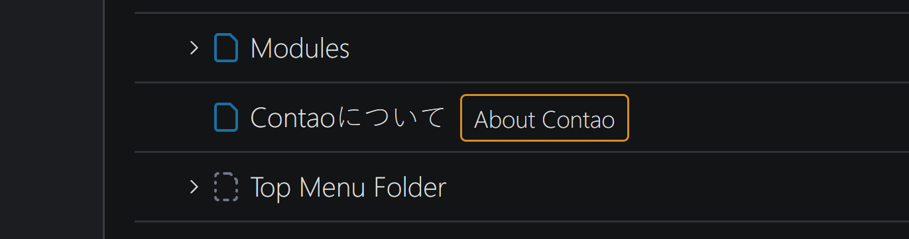
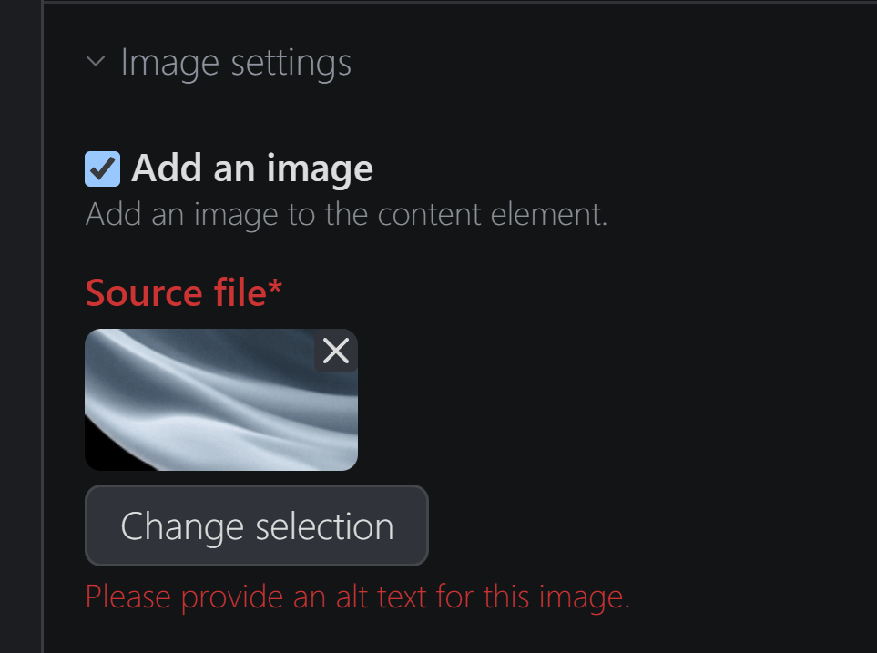
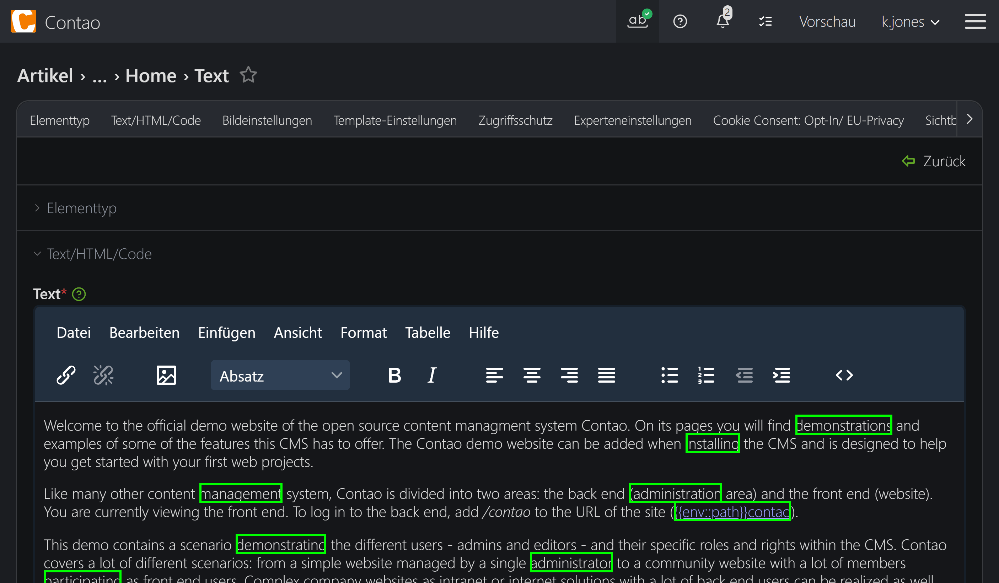

# Contao Backend Helper

[](https://packagist.org/packages/numero2/contao-backend-helper) [](http://www.gnu.org/licenses/lgpl-3.0)

A collection of small tools that help simplify everyday backend work.

> [!NOTE]
> Please note that, except for the page info field, all other helpers must be explicitly enabled via the `config.yaml`.

### Info Field for Pages / Articles

Sometimes it is useful to provide editors or users with additional information about a page or article directly within the page structure.
This is especially helpful for multilingual installations where not everyone may know, for example, what a specific page is named like in Japanese.



### "Enforcing" Accessibility

By enabling the `a11y_enforcer` helper (see Example Configuration below), you can require editors to provide an alternative text and/or a caption when using images.
This feature applies to both the `singleSRC` (single image) and `multiSRC` (image gallery) fields within `tl_content`.
Each field is configured independently via the `images` list, allowing different requirements and URL filters per field.



### Highlighting Long Words

Especially in the age of responsive websites, it is important to ensure that content displays properly across different devices.
Very long words can cause layout issues. Contao provides a basic entity for so-called “soft hyphens” (`[-]`), which allows words to break at predefined positions when necessary.
After enabling the `long_word_highlighter` helper and defining the minimum word length (`min_length`) - which highly depends on the specific layout - editors can activate the highlighting feature to easily identify words that should be separated with soft hyphens.



---

## Requirements

- [Contao](https://github.com/contao/contao) **5.7 or newer**

---

## Installation

Via **Contao Manager** or **Composer**:

```bash
composer require numero2/contao-backend-helper
```

---

## Example Configuration

```yaml
backend_helper:
    a11y_enforcer:
        enabled: false                              # disabled by default
        images:
            - field: "tl_content.singleSRC"         # applies to single image fields in tl_content
              require_alt: true                     # default for singleSRC: alt text is mandatory
              require_caption: false                # default for singleSRC: caption is not mandatory
              filter:
                - "do=news.*[?&]table=tl_content"   # force checks only on content elements within news articles
            - field: "tl_content.multiSRC"          # applies to image gallery fields in tl_content
              require_alt: false                    # default for multiSRC: alt text is not mandatory
              require_caption: true                 # captions are mandatory
              filter:
                - "do=news.*[?&]table=tl_content"
            - field: "tl_news.singleSRC"            # applies to single image fields in tl_news
              require_alt: true
              require_title: true
    long_word_highlighter:
        enabled: false                              # disabled by default
        min_length: 10                              # every word with more than 10 letters is considered as too long
```